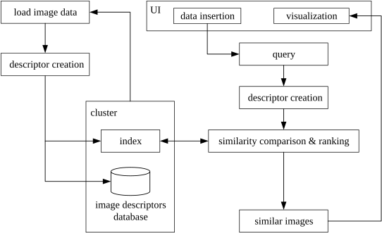
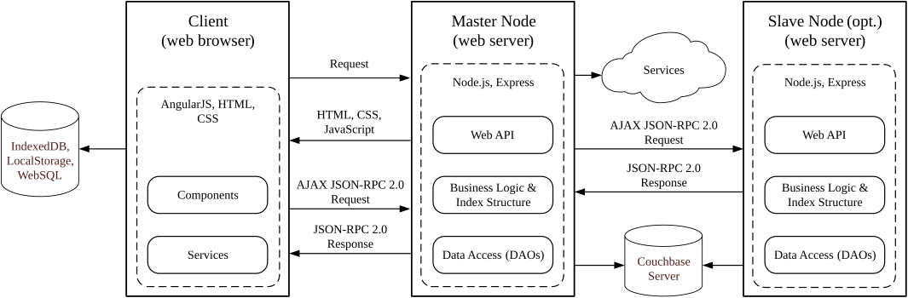
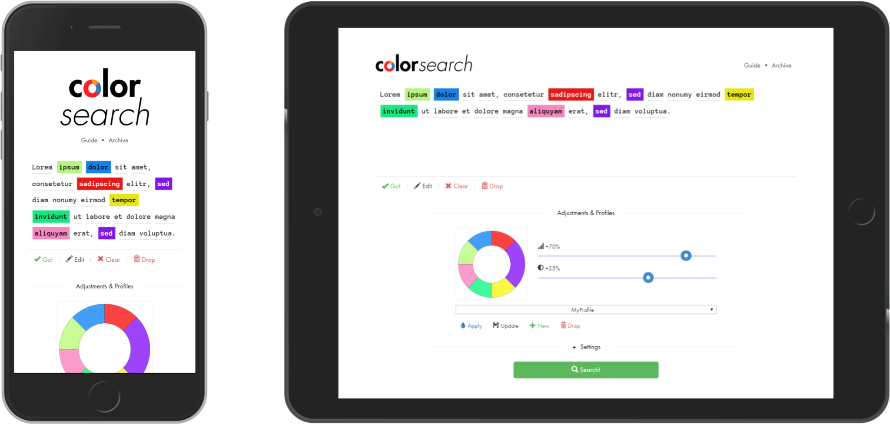

# Color Search

Experimental 2018 CBIR application for multimodal image search based on color and text.

## Overview

Color Search is an experimental CBIR web application that retrieves images based on user-defined colors and words. It combines color-based image retrieval with semantic reranking based on automatically generated image tags, NLP methods, and multimodal image descriptors.

The system was implemented as a distributed client-server architecture with parallel search across multiple nodes, NoSQL storage, and indexing for high-dimensional feature vectors.

It combines several ideas:

- color-based image retrieval
- semantic text similarity with word embeddings
- approximate search with MinHash and LSH
- image tagging and enrichment workflows
- a distributed master/slave architecture

## Stack

- AngularJS
- Node.js and Express
- TypeScript
- Gulp and Webpack
- MongoDB / Couchbase
- Flickr, Clarifai, and Imagga integrations

## Status

- archived
- dependencies are outdated

## Notes

- The word embeddings file (`vecs300.txt`) is omitted from the repository to keep the repository lightweight.
- Download the GitHub Release asset `vecs300.zip`, extract `vecs300.txt`, and place it in `app/master/dist/server/core/text-similarity/vecs/`.
- For rebuilding the project, place `vecs300.txt` in `app/master/src/server/server/core/text-similarity/vecs/`.

## Screenshots

### System Design

#### Retrieval Pipeline

The diagram below shows the data flow for image ingestion, descriptor creation, indexing, and similarity search.

#### Architecture

This diagram shows the system architecture: browser client, master node, optional slave node, and backing services.

### GUI

